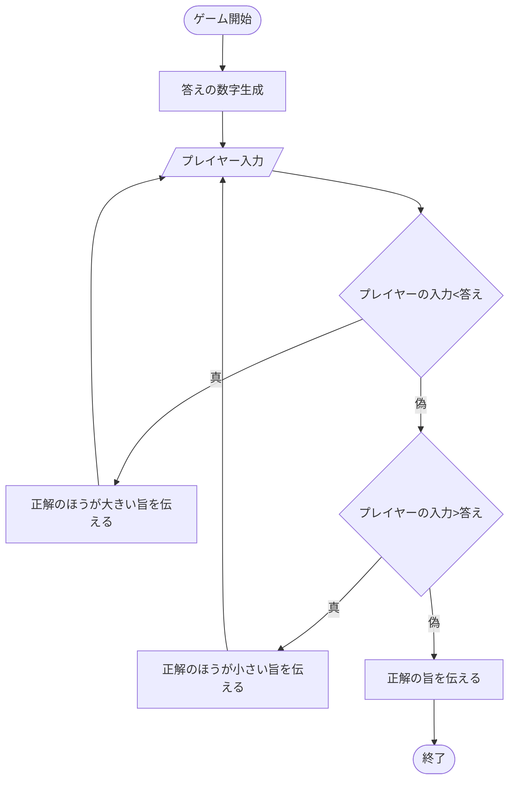
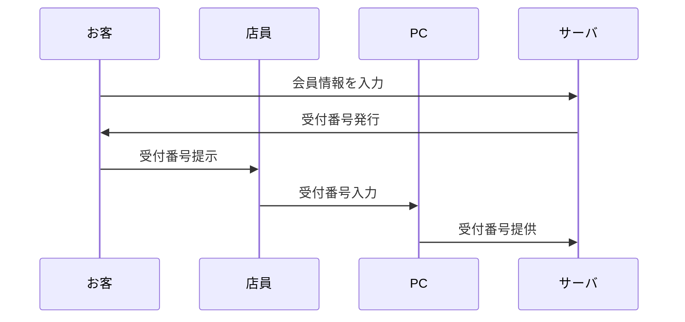
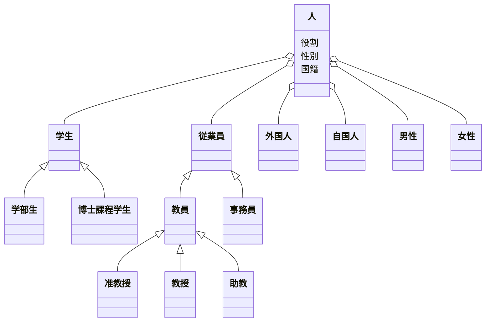

# 課題
Mermaidを触ってみよう

マークダウンファイルを編集して、Mermaidで図を描いてみよう

# 取り組み方
* 本プロジェクトをforkしてください。
* README.mdを編集して、Mermaidを使いこなしてください
* できたらプルリクエストを出します

# 課題項目
## 流れ図
### 条件
- 開始と終了ノードをつける
- 条件分岐を組み込む
- 5ノード以上
- カッコいいほど高得点

## 解答
-テーマ:数当てゲーム

## シーケンス図
### 条件
- 3人以上
- メッセージをやり取りしない人がいないように
- 自己呼び出しを含むこと
- カッコいいほど高得点

## 解答
-テーマ:カラオケの会員登録

  loop サーバ処理
      受付番号確認
  end
  サーバ->>PC: 本人確認画面を表示
  店員->>お客: 身分証提示を要求
  お客->>店員: 身分証を提示
  店員->>PC: 身分証情報を入力
  PC->>サーバ: 身分証情報を提供
  loop サーバ処理
      会員登録
  サーバ-->>お客: 会員登録完了のメッセージ

## クラス図

### 条件
- 3つ以上
- 汎化と集約を含むこと
- カッコいいほど高得点

## 解答
-テーマ:大学内の人 

