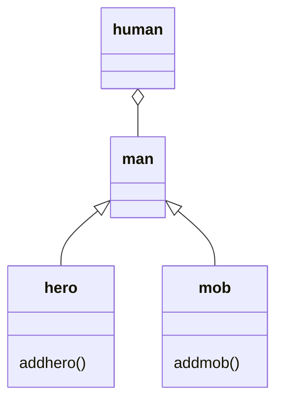

# 課題
Mermaidを触ってみよう

マークダウンファイルを編集して、Mermaidで図を描いてみよう

# 取り組み方
* 本プロジェクトをforkしてください。
* README.mdを編集して、Mermaidを使いこなしてください
* できたらプルリクエストを出します

# 課題項目
## 流れ図
### 条件
- 開始と終了ノードをつける
- 条件分岐を組み込む
- 5ノード以上
- カッコいいほど高得点

## 解答
```mermaid
flowchart LR;
  A([開始]) --> B([/xへの入力/]);
  B --> C{x == 5}
　C -- true -->  D[[x --]]
  D --> B
  C -- false --> F[xは5です]；
　F --> E([終了])
```

## シーケンス図
### 条件
- 3人以上
- メッセージをやり取りしない人がいないように
- 自己呼び出しを含むこと
- カッコいいほど高得点

## 解答
```mermaid
sequenceDiagram
　料理人 ->> フライパン: ハンバーグを焼く
　フライパン -->> 料理人 : 焼きあがった。
  料理人 ->> 客;提供
　human ->> 客 : 食べる
 end

```

## クラス図

### 条件
- 3つ以上
- 汎化と集約を含むこと
- カッコいいほど高得点

## 解答

