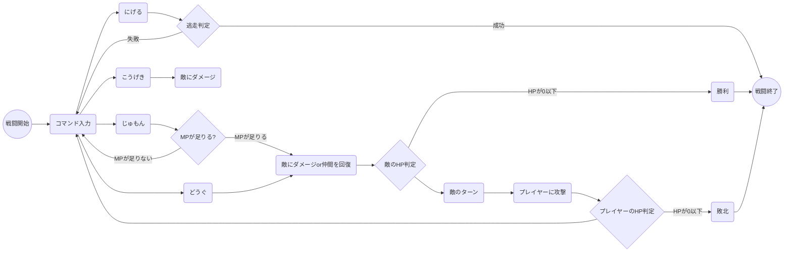
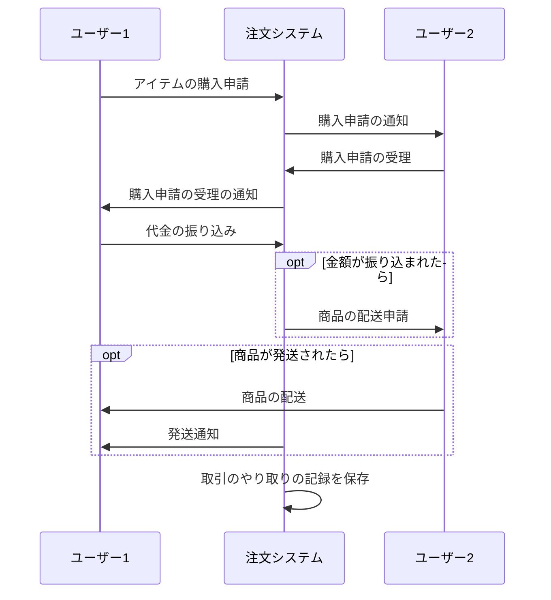

# 課題
Mermaidを触ってみよう

マークダウンファイルを編集して、Mermaidで図を描いてみよう

# 取り組み方
* 本プロジェクトをforkしてください。
* README.mdを編集して、Mermaidを使いこなしてください
* できたらプルリクエストを出します

# 課題項目
## 流れ図
### 条件
- 開始と終了ノードをつける
- 条件分岐を組み込む
- 5ノード以上
- カッコいいほど高得点

## 解答
RPGの戦闘システム


## シーケンス図
### 条件
- 3人以上
- メッセージをやり取りしない人がいないように
- 自己呼び出しを含むこと
- カッコいいほど高得点

## 解答
フリマアプリのやり取り


## クラス図

### 条件
- 3つ以上
- 汎化と集約を含むこと
- カッコいいほど高得点

## 解答
RPGのキャラクター
```mermaid
classDiagram
人間<|--戦士
人間<|--魔法使い
人間<|--僧侶
人間<|--勇者
人間:年齢
人間:名前
人間:性別
戦士:+技が使える()
魔法使い:+攻撃魔法が使える()
僧侶:+回復魔法が使える()
勇者:+必殺技が使える()
戦士--oパーティー
魔法使い--oパーティー
僧侶--oパーティー
勇者--oパーティー
