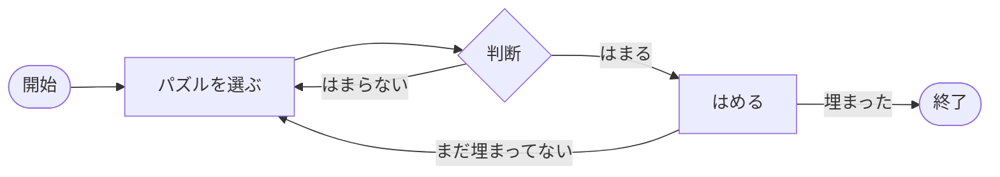
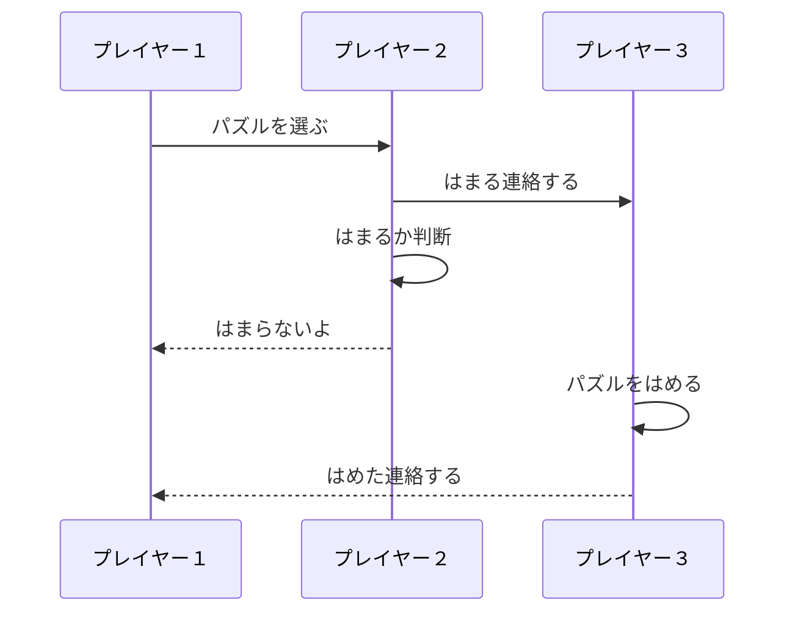

# 課題
Mermaidを触ってみよう

マークダウンファイルを編集して、Mermaidで図を描いてみよう

# 取り組み方
* 本プロジェクトをforkしてください。
* README.mdを編集して、Mermaidを使いこなしてください
* できたらプルリクエストを出します

# 課題項目
## 流れ図
### 条件
- 開始と終了ノードをつける
- 条件分岐を組み込む
- 5ノード以上
- カッコいいほど高得点

## 解答


## シーケンス図
### 条件
- 3人以上
- メッセージをやり取りしない人がいないように
- 自己呼び出しを含むこと
- カッコいいほど高得点

## 解答


## クラス図

### 条件
- 3つ以上
- 汎化と集約を含むこと
- カッコいいほど高得点

## 解答
```mermaid
classDiagram
class 盤面 {
  -int judge
    +はまる()
    +はまらない()
}
class ピース{
  +上向き()
  +下向き()
  +右向き()
  +左向き()
}
class はめる人{
  +はめる()
  +はめない()
}
class Size{
  -int size
}
class Number{
  -int number
}
盤面 <|-- ピース
盤面 <|-- はめる人
盤面 o-- Size
盤面 o-- Number