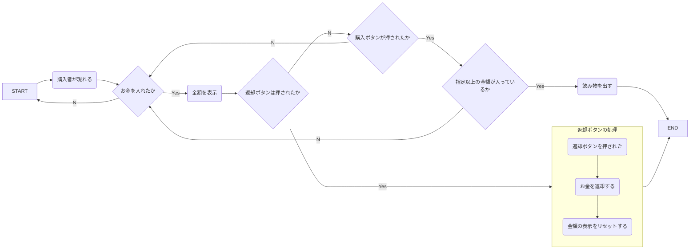
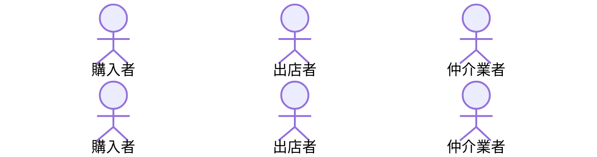

# 課題
Mermaidを触ってみよう

マークダウンファイルを編集して、Mermaidで図を描いてみよう

# 取り組み方
* 本プロジェクトをforkしてください。
* README.mdを編集して、Mermaidを使いこなしてください
* できたらプルリクエストを出します

# 課題項目
## 流れ図
### 条件
- 開始と終了ノードをつける
- 条件分岐を組み込む
- 5ノード以上
- カッコいいほど高得点

## 解答

## シーケンス図
### 条件
- 3人以上
- メッセージをやり取りしない人がいないように
- 自己呼び出しを含むこと
- カッコいいほど高得点

## 解答

## クラス図

### 条件
- 3つ以上
- 汎化と集約を含むこと
- カッコいいほど高得点

## 解答
classDiagram
  会社<|--社員
  class 会社
  {
    +名前:string
    +住所:string
    +電話番号:int
    +入社手続き()
    +退社手続き()
  }
  class　社員
  {
    +社員番号:int
    +名前:string
    +年齢:int
    +性別:bool
  }
  class 技術社員
  {
    +システム開発を行う
  }
  class 営業社員
  {
    +営業を行う
  }
  class 事務社員
  {
    +事務作業を行う
  }
